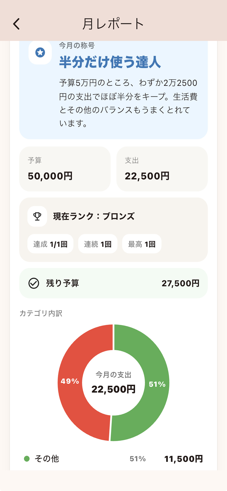

# Wallet Days

A budgeting app that visualizes how long your money will last based on your current spending pace.

Instead of focusing on strict budgeting, Wallet Days helps users understand their spending habits through a simple and intuitive experience.

🍎 App Store  
[Download on the App Store](https://apps.apple.com/jp/app/%E8%B2%A1%E5%B8%83%E3%81%AE%E4%BD%99%E5%91%BD/id6760900312)

🤖 Google Play  
Closed Testing

---

## Screenshots

| Home | Rank |
|------|------|
|  |  |

| Monthly Report | Widget |
|------|------|
|  |  |

---

## Features

- Budget tracking
- Remaining days estimation
- Spending analysis by category
- Monthly reports
- Home screen widgets
- Achievement system
- AI-powered spending comments
- Data backup & restore
- Japanese / English support

---

## Tech Stack

### Mobile

- Flutter
- Dart

### Backend

- Supabase
- PostgreSQL
- Edge Functions
- Cloud Functions

### Services

- RevenueCat
- OpenAI API

### Local Storage

- Isar

### Other

- Anonymous Authentication
- Multi-language Support
- Home Screen Widgets
- Backup & Restore

---

## Why I Built This

Many budgeting apps focus on detailed expense management.

I wanted to create a simpler experience that helps users understand how quickly they are spending money and whether their budget will last until the end of the month.

The goal was to create a budgeting experience that feels approachable and sustainable rather than strict and overwhelming.

---

## Development Highlights

- Built and released a production mobile application using Flutter
- Designed and implemented a Supabase backend
- Implemented subscription management using RevenueCat
- Integrated AI-powered spending insights
- Developed backup and restore functionality
- Added multilingual support (Japanese / English)
- Implemented home screen widgets
- Managed App Store release and Google Play closed testing

---

## Author

### Shinshun Matayoshi

Flutter Developer from Japan

GitHub:
https://github.com/mata-s
